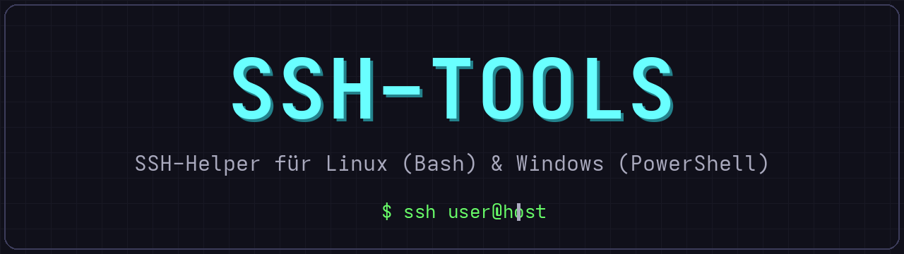
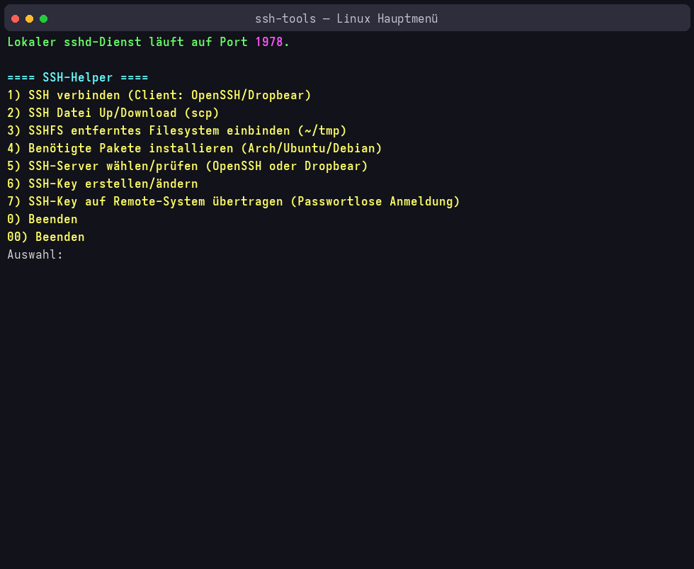
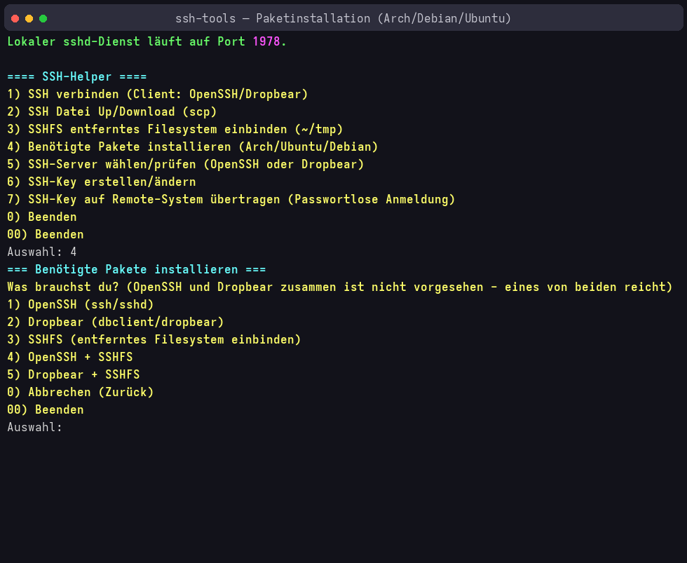
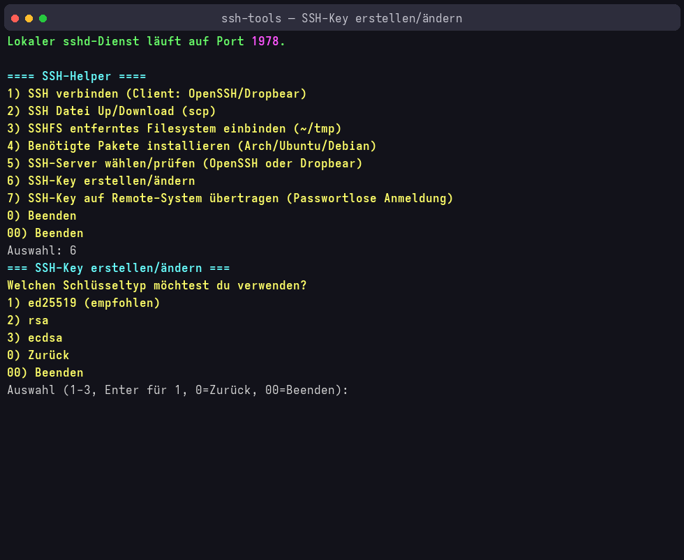
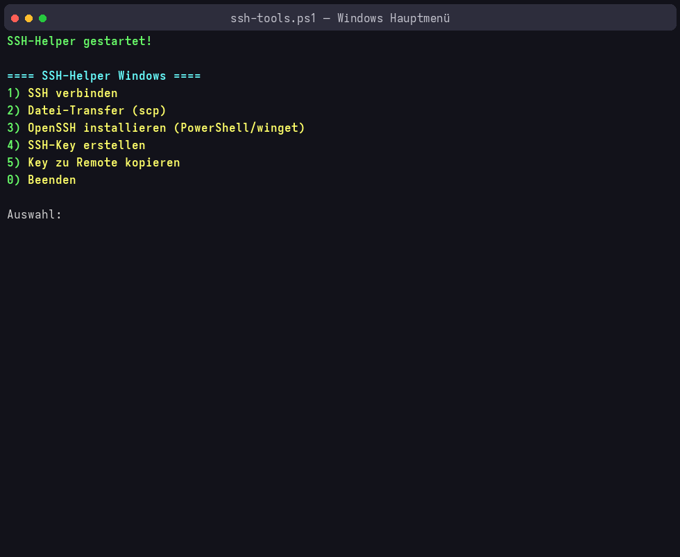
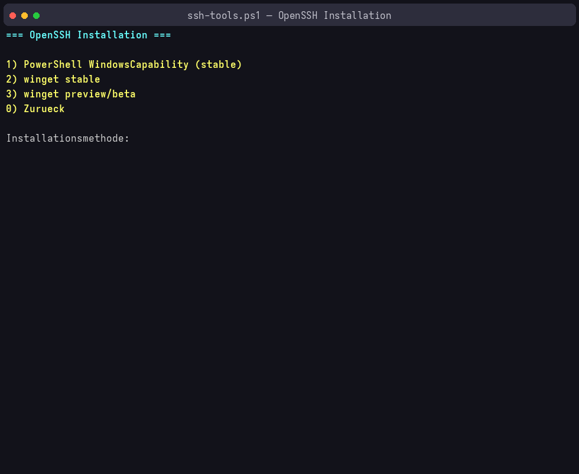

<p align="center">
  
</p>

**Sprache / Language:** [Deutsch](README.md) · [English](README.en.md)

# SSH-Tools

**SSH-Tools** ist ein interaktives Menü-Werkzeug, das die täglichen SSH-Aufgaben vereinfacht: Verbindungen aufbauen, Dateien übertragen, Server installieren und konfigurieren, SSH-Keys erstellen und auf Remote-Systeme verteilen.

Das Projekt besteht aus zwei Skripten:

| Skript | Plattform | Beschreibung |
|---|---|---|
| `ssh-tools` | Linux (Bash) | Vollständiger Funktionsumfang inkl. SSHFS und Dropbear |
| `ssh-tools.ps1` | Windows (PowerShell) | Gleicher Kernkomfort, Windows-typische Installation über WindowsCapability/winget |

Beide Skripte sind rein interaktiv — einfach starten, Menüpunkt wählen, fertig. Es gibt keine Konfigurationsdateien und keine Abhängigkeiten außer den genannten Programmen.

---

## Funktionen unter Linux (`ssh-tools`)

Das Bash-Skript führt die lokalen Pakete nach, konfiguriert bei Bedarf den SSH-Server und bietet diese Menüpunkte:

### 1) SSH verbinden (Client: OpenSSH / Dropbear)
- Baut eine interaktive SSH-Sitzung auf — wahlweise mit **OpenSSH (`ssh`)** oder mit **Dropbear (`dbclient`)**.
- Fragt einmalig Benutzer, Host/IP und Port ab und merkt sich die Verbindungseinstellungen für die gesamte Sitzung (Wiederverwendung mit `j` bestätigen).
- Vorhandene Einstellungen werden vor jeder Aktion angezeigt und können überschrieben werden.

### 2) SSH Datei Up/Download (scp)
- Dateien und komplette Ordner (`-r`) per **`scp`** hochladen (lokal → remote) oder herunterladen (remote → lokal).
- Verwendet dieselben gemerkten Verbindungsdaten wie die anderen Funktionen.

### 3) SSHFS – entferntes Filesystem einbinden (`~/tmp`)
- Bindet ein Verzeichnis des Remote-Systems per **SSHFS** nach `~/tmp` ein.
- Nach dem Mount bleibt das Verzeichnis so lange eingebunden, bis Enter gedrückt wird — dann wird es sauber ausgehängt (`fusermount`/`fusermount3`/`umount` mit Fallback-Kette).
- Der Mount wird **automatisch gelöst**, wenn das Skript beendet oder mit **Strg+C** abgebrochen wird — es bleibt nie ein verwaister Mount zurück.

### 4) Benötigte Pakete installieren (Arch / Ubuntu / Debian)
- Erkennt automatisch die Paketverwaltung (`pacman` oder `apt-get`) und installiert:
  - **OpenSSH** (Client + Server)
  - **Dropbear** (`dropbear` + `dropbear-bin`)
  - **SSHFS**
  - oder Kombinationen (OpenSSH + SSHFS, Dropbear + SSHFS)
- Auf Debian/Ubuntu werden automatisch die richtigen Paketnamen verwendet (`openssh-client`/`openssh-server`, `dropbear-bin`).
- Nach der Installation wird direkt die Port-Konfiguration durchlaufen (siehe Funktion 5) und der Dienst neu gestartet.

### 5) SSH-Server wählen/prüfen (OpenSSH oder Dropbear)
- Zeigt den Zustand beider SSH-Server: installiert? Dienst läuft? auf welchem Port?
- Liest den Port automatisch aus `/etc/ssh/sshd_config` bzw. `/etc/conf.d/dropbear` (Debian: `/etc/default/dropbear`) aus.
- **OpenSSH konfigurieren/starten:** fragt den Port ab, trägt ihn in `sshd_config` **und** `ssh_config` ein (vorhandene `Port`-Zeile wird ersetzt, sonst oben eingefügt), aktiviert und startet den Dienst (`sshd` unter Arch, `ssh` unter Debian/Ubuntu — wird automatisch erkannt).
- **Dropbear konfigurieren/starten:** fragt den Port ab, trägt ihn in die Dropbear-Konfiguration ein und aktiviert/startet den Dienst.

### 6) SSH-Key erstellen/ändern
- Erstellt neue Schlüssel mit **ed25519** (empfohlen), **RSA** oder **ECDSA** über `ssh-keygen`.
- Freie Wahl von Pfad und Dateinamen, Standard ist `~/.ssh/id_<typ>`.
- Existiert der Schlüssel bereits, kann gewählt werden:
  - Schlüssel komplett **neu erstellen** (mit Sicherheitsabfrage), oder
  - nur die **Passphrase ändern** (`ssh-keygen -p`).

### 7) SSH-Key auf Remote-System übertragen
- Spielt einen öffentlichen Schlüssel (`.pub`) per **`ssh-copy-id`** auf den Remote-Host — damit entfällt künftig die Passwortabfrage.
- Standardpfad ist `~/.ssh/id_ed25519.pub`, jeder andere Pfad kann angegeben werden.

### Bedienung & Komfort
- **`0`/`00`-Regel:** In jedem Untermenü bedeutet `0` *Zurück* und `00` *Beenden*.
- Beim Beenden wird ein eventuell vorhandener SSHFS-Mount immer sauber gelöst.
- **`-nc` / `--no-color`:** Farbausgabe abschalten (für alte Konsolen oder Weiterleitung); zusätzlich wird die Umgebungsvariable **`NO_COLOR`** respektiert.
- Farbdesign: Cyan = Überschriften, Gelb = Eingaben, Rot = Fehler/Warnungen, Magenta = Dateien/Befehle, Grün = Status/Erfolg.

### Voraussetzungen (Linux)
- Bash, `sudo`-Rechte für Installation/Konfiguration
- Optional je nach Funktion: `openssh`, `dropbear`/`dropbear-bin`, `sshfs`
- Unterstützte Paketverwaltungen: **pacman** (Arch) und **apt-get** (Debian/Ubuntu)

### Start (Linux)
```bash
chmod +x ssh-tools
./ssh-tools          # mit Farben
./ssh-tools --no-color   # ohne Farben
```

---

## Funktionen unter Windows (`ssh-tools.ps1`)

Das PowerShell-Skript bietet den gleichen Kernkomfort; SSHFS ist unter Windows nicht enthalten, dafür gibt es die typischen Windows-Installationswege.

### 1) SSH verbinden
- Baut eine interaktive SSH-Sitzung mit dem Windows-OpenSSH-Client auf.
- Fragt Benutzer, Host/IP und Port ab (Standard 22) und merkt sich die Daten für die Sitzung.
- Fehlt `ssh.exe`, wird die OpenSSH-Installation (Menüpunkt 3) direkt angeboten.

### 2) Datei-Transfer (scp)
- Upload und Download von Dateien/Ordnern per `scp` (immer rekursiv).
- Prüft lokale Pfade vor dem Transfer und zeigt den ausgeführten SCP-Befehl sowie den Exit-Code an.
- Verwendet dieselben gemerkten Verbindungsdaten.

### 3) OpenSSH installieren (PowerShell / winget)
Drei Installationsmethoden:
- **PowerShell WindowsCapability** (`Add-WindowsCapability -Online`) — der klassische, stabile Weg; prüft zuerst den Installationsstatus und installiert Client, Server oder beides.
- **winget stable** (`Microsoft.OpenSSH` / `Microsoft.OpenSSH.Server`)
- **winget preview/beta** (`Microsoft.OpenSSH.Beta` / `Microsoft.OpenSSH.Beta.Server`)

Je nach Methode kann nur der Client, nur der Server oder beides installiert werden; bereits installierte Komponenten werden erkannt und übersprungen.

### 4) SSH-Key erstellen
- Erstellt Schlüssel mit **ed25519**, **RSA** oder **ECDSA** via `ssh-keygen`.
- Standardablage: `%USERPROFILE%\.ssh\id_<typ>` (Ordner wird bei Bedarf angelegt).
- Existiert der Schlüssel bereits: neu erstellen oder nur die Passphrase ändern.

### 5) Key zu Remote kopieren
- Überträgt den öffentlichen Schlüssel auf den Remote-Host (auf Linux-Hosts via `ssh`-Befehl nach `~/.ssh/authorized_keys` inkl. korrekter Rechte `700`/`600`) — passwortlose Anmeldung danach möglich.
- Standardpfad: `%USERPROFILE%\.ssh\id_ed25519.pub`.

### Bedienung & Komfort (Windows)
- **`-Help` / `-h`:** zeigt die ausführliche Hilfe (`Get-Help -Detailed`) an, ohne das Menü zu starten.
- VT-Farbausgabe wird automatisch aktiviert (ENABLE_VIRTUAL_TERMINAL_PROCESSING); funktioniert das nicht (alte Konsole, Weiterleitung), schaltet das Skript automatisch auf farblose Ausgabe um — es erscheinen niemals rohe ESC-Zeichen.
- Gleiche Farbsprache wie die Linux-Version.

### Voraussetzungen (Windows)
- PowerShell 5.1 oder 7+ (Windows PowerShell oder PowerShell Core)
- Für Installation: Admin-Rechte sowie WindowsCapability- oder winget-Verfügbarkeit
- Für SSH/scp/ssh-keygen: OpenSSH Client (wird bei Bedarf über Menüpunkt 3 nachinstalliert)

### Start (Windows)
```powershell
Set-ExecutionPolicy -Scope Process Bypass   # falls nötig
.\ssh-tools.ps1
.\ssh-tools.ps1 -Help
```

---

## Screenshots

### Linux (Bash)
<p align="center">
  
</p>
<p align="center">
  
</p>
<p align="center">
  
</p>

### Windows (PowerShell)
<p align="center">
  
</p>
<p align="center">
  
</p>

---

## Lizenz

Dieses Projekt steht unter der **GNU General Public License v3.0** — siehe [LICENSE](LICENSE).
